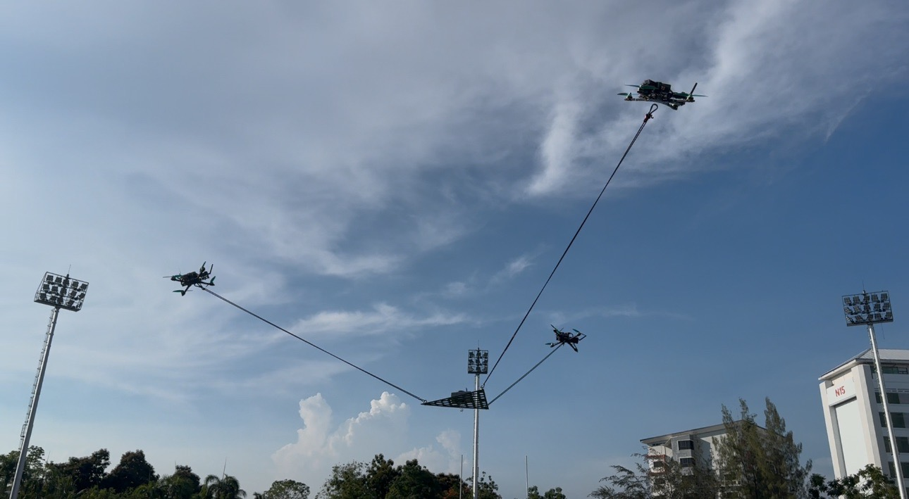
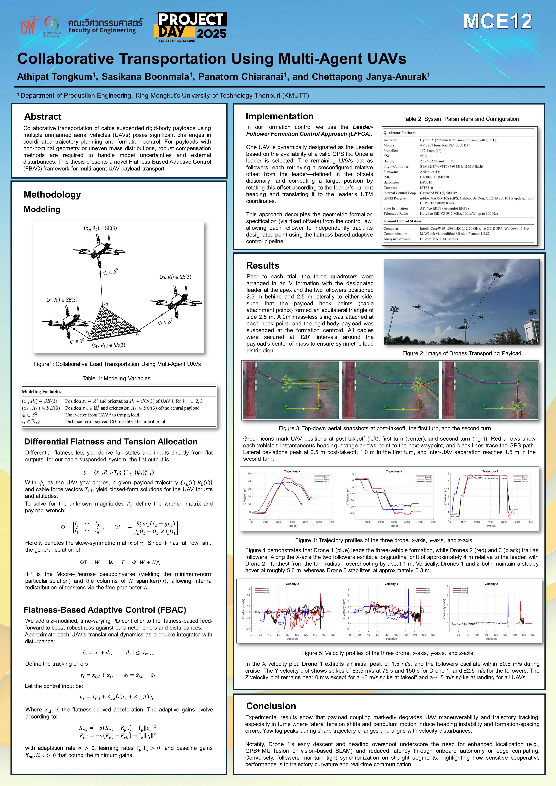

# MissionPlanner_SwarmControl

The aim of this repository is to develop a multi-uav controller for collborative transportation of rigid bodied suspended loads. The controller is based on differential flatness and adaptive control taken from **Sreenath, Koushil & Kumar, Vijay. (2013). Dynamics, Control and Planning for Cooperative Manipulation of Payloads Suspended by Cables from Multiple Quadrotor Robots.** and **Su, Yu-Hsiang & Bhowmick, Parijat & Lanzon, Alexander. (2023). A robust adaptive formation control methodology for networked multi-UAV systems with applications to cooperative payload transportation.**

THIS PROJECT IS SUBMITTED IN PARTIAL FULFILLMENT OF THE REQUIREMENTS FOR THE DEGREE OF BACHELOR OF ENGINEERING (MECHATRONICS ENGINEERING), FACULTY OF ENGINEERING, KING MONGKUT’S UNIVERSITY OF TECHNOLOGY THONBURI, 2024

---

## How to compile

### On Windows (Recommended)

#### 1. Install software

##### Main requirements

Currently, Mission Planner needs:

Visual Studio 2022

##### IDE

### Visual Studio Community
To compile Mission Planner, we recommend using Visual Studio. You can download Visual Studio Community from the [Visual Studio Download page](https://visualstudio.microsoft.com/downloads/ "Visual Studio Download page").

Visual Studio is a comprehensive suite with built-in Git support, but it can be overwhelming due to its complexity. To streamline the installation process, you can customize your installation by selecting the relevant "Workloads" and "Individual components" based on your software development needs.

To simplify this selection process, we have provided a configuration file that specifies the components required for MissionPlanner development. Here's how you can use it:

1. Go to "More" in the Visual Studio installer.
2. Select "Import configuration."
3. Use the following file: [vs2022.vsconfig](https://raw.githubusercontent.com/ArduPilot/MissionPlanner/master/vs2022.vsconfig "vs2022.vsconfig").

By following these steps, you'll have the necessary components installed and ready for Mission Planner development.

###### VSCode
Currently VSCode with C# plugin is able to parse the code but cannot build.

---

#### 2. Get the code

If you get Visual Studio Community, you should be able to use Git from the IDE. 
Clone `https://github.com/C-PANATORN/MissionPlanner_SwarmControl.git` to get the full code.

In case you didn't install an IDE, you will need to manually install Git. Please follow instruction in https://ardupilot.org/dev/docs/where-to-get-the-code.html#downloading-the-code-using-git

Open a git bash terminal in the MissionPlanner directory and type, "git submodule update --init" to download all submodules

Alternatively, if you have installed MissionPlanner from the main branch, you can manually replace the ".csproj" and "formation.cs" files directly from this repository and compile the code. **Note: if you use this method you need to delete all cashe memory of your previous installation**

#### 3. Build

To build the code:
- Open MissionPlanner.sln with Visual Studio
- From the Build menu, select "Build MissionPlanner"

### On other systems
Building Mission Planner on other systems isn't support currently.

---

